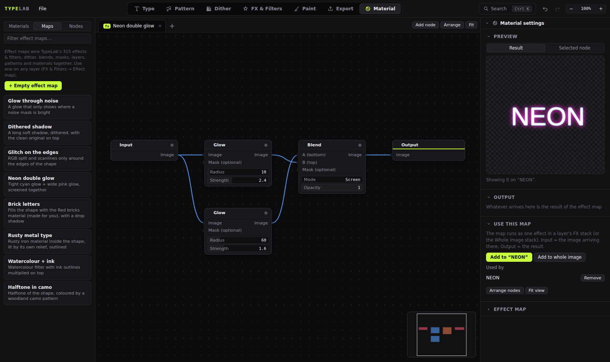
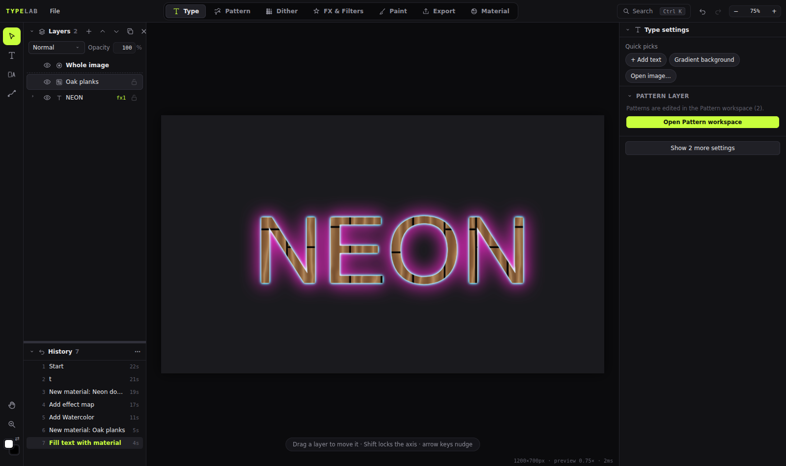
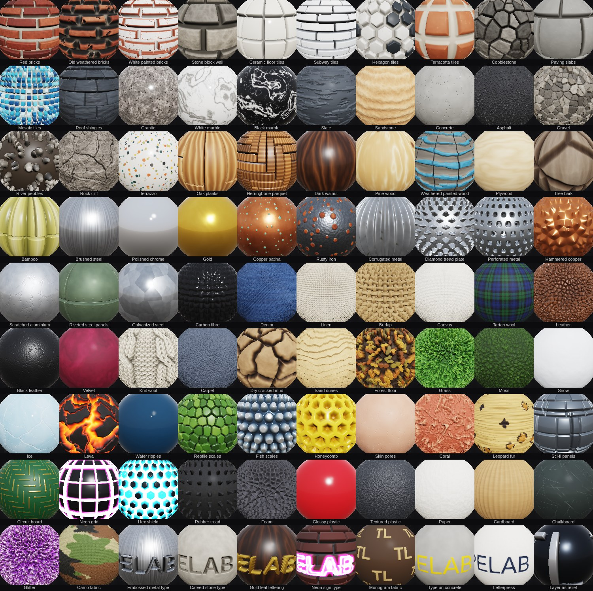

# TypeLab Material: materials + effect maps

A **Material** workspace for TypeLab (tab 7), in the style of [Material Maker](https://github.com/RodZill4/material-maker). It does three jobs:

1. **Materials.** You build seamless PBR materials (colour, normal, roughness, metal, AO and height maps) in a node graph, preview them in 3D or 2D, and export them as a map zip.
2. **Effect maps.** All of TypeLab's 313 effects and filters, its dither, the 27 blend modes, masks, layers, patterns and materials become **nodes you can join freely**. A whole map then runs as **one "Effect map" entry** in any layer's FX stack, or in the Whole image stack.
3. **Joined both ways:**
   - Materials work as Pattern generators (pattern layers, *Fill selected text*, the texture brush) and through a **Material** effect (relief from the real normal map).
   - TypeLab's effects and filters work *inside* materials, and stay seamless.

**To install, copy the 11 files and add 11 lines to `app/index.html`. No existing TypeLab file is edited.** The steps are in [INSTALL.md](INSTALL.md).

| | |
|---|---|
| Starter materials | **90**, in 10 groups. All of them are in [docs/CATALOG.md](docs/CATALOG.md). |
| Starter effect maps | **8**: Glow through noise, Dithered shadow, Glitch on the edges, Neon double glow, Brick letters, Rusty metal type, Watercolour + ink, Halftone in camo |
| Material nodes | 54 GPU nodes, plus 313 TypeLab effects and filters as nodes. They run on CPU and use a 3×3 wrap to stay seamless. |
| Effect-map nodes | 347: 312 TypeLab effects and filters, each with an optional Mask input, plus Input, Output, Dither, Blend (27 modes), Mix, Cut out, Mask from image, Mask adjust, Layer, Document, Solid colour, Pattern, Material, 19 tiled generators, and Transform |
| Previews | Materials: 3D (sphere, rounded cube, cylinder, plane; GGX lighting; parallax depth) or 2D (tiled, per channel, per node). Effect maps: the result on the layer that uses the map, or any single node. |
| Undo, save | Everything lives in `doc.materials`, so every edit is one undo step and is kept in `.typelab` files and autosave |







## Files

```
app/css/material.css                 styles (TypeLab tokens)
app/js/material/mat-glsl.js          GLSL library: integer hashes, periodic noise / fbm / voronoi, SDFs
app/js/material/mat-core.js          node registry (kinds: material | effect), graph model, GPU engine (own WebGL2 context), display, readback
app/js/material/mat-nodes.js         built-in GPU material nodes + the Material output
app/js/material/mat-nodes-typelab.js Text · Layer · Document · Pattern · Image source nodes (materials)
app/js/material/mat-presets.js       the 90 starter materials (builder API)
app/js/material/mat-preview3d.js     3D preview
app/js/material/mat-link.js          joins: materials as Pattern generators, the "Material" effect, TypeLab FX as material nodes, cache keys
app/js/material/mat-fxmap.js         effect maps: engine, nodes, the "Effect map" effect, hosts, 8 starter maps
app/js/material/mat-graph.js         the node editor (shared by materials and effect maps)
app/js/ui/mode-material.js           the workspace: library (Materials / Maps / Nodes), tabs, inspector, export, key guard, Ctrl+K
index.html.patch                     the 11 added lines
tests/                               Playwright suites (all pass): nodes, materials, ui, ui-maps, effectmaps
docs/                                CATALOG.md + screenshots
```

## How it works

**Data.** `TL.doc.materials` holds both kinds of graph:
- materials: `{ id, name, size, nodes, links }`
- effect maps: `{ id, name, kind: 'effect', nodes, links }`

How each is used:
- A layer uses a map through the effect `{ type: 'effectmap', p: { map: id } }`.
- It uses a material through `{ type: 'matfx', p: { mat: id } }`, or through a pattern layer whose `gen` is `'mat-<id>'`.
- `mat-core.js` wraps `TL.migrate` so old and damaged documents get a valid list.
- The Image node stores its picture under `imageId`, a key TypeLab's asset tracking already knows, so it is saved and kept.

**Material engine.**
- It runs in its own WebGL2 context. Each node output is a fragment shader rendering into an RGBA16F texture with REPEAT wrapping.
- Results are cached by a hash of everything upstream, so a change re-runs only the nodes below it.
- CPU nodes (TypeLab effects) run on the tile laid out 3×3 and keep the centre, which keeps them seamless.

**Effect-map engine.**
- Values are document-size canvases at the render scale.
- Every `TL.fx` effect becomes a node through one wrapper around `TL.fx.apply(canvas, [effect], env)`. A straight chain in a map gives the same pixels as the plain effect list; this is tested, with a max difference of 0.
- **Caching:**
  - A node whose result doesn't depend on the input image is cached across renders. That covers sources, generators and anything built only from them.
  - Inside a normal render, nodes that do depend on the input run every time. This is cheap, because TypeLab's layer cache already skips layers that didn't change.
  - In the Material-tab preview the input's hash is known, so every node is cached there.
- **No loops:** effect maps nested inside a map, or inside a Document or Layer node, pass their input through unchanged.

**Hooks.** The add-on hooks into TypeLab by wrapping existing functions, never by editing files:

| Wrapped | Why |
|---|---|
| `UI.setMode`, `UI.refresh`, `UI.buildTopbar` | show and hide the workspace, set the tab tooltip |
| `UI.paramControl` | add material and map pickers (with "Edit in Material tab") to FX cards |
| `TL.migrate` | keep `doc.materials` valid |
| `TL.render.key` | add the material's or map's version, so layers re-render when a graph changes |
| `TL.patterns.tileCanvas`, `tileCanvasAsync`, `items`, `svgBody` | serve `mat-*` generators |
| `TL.fx.apply` | remember the stack's `env` (bounds) for map nodes |
| `TL.fx.prepare` | also prepare texture filters inside maps before an export |

There is also a capture-phase key guard. Without it, Delete in the graph would delete the selected *layer*.

## Extending

```js
// GPU material node (see the conventions at the top of mat-nodes.js)
TL.mat.def({ id: 'rings', name: 'Rings', cat: 'Generators', params: [{ k: 'count', label: 'Count', min: 1, max: 32, def: 6, step: 1 }],
  outputs: [{ k: 'out', label: 'Out', type: 'gray', expr: '0.5 + 0.5*cos(length(fract(uv) - 0.5)*p_count*TAU)' }] });

// effect-map node (canvases): run(ctx, node, inputs, outIndex) → canvas
TL.mat.def({ kind: 'effect', id: 'fxflip', name: 'Flip', cat: 'Transform', inputs: [{ k: 'in', label: 'Image', type: 'color' }],
  outputs: [{ k: 'out', label: 'Image', type: 'color' }],
  run: (ctx, n, [src]) => { if (!src) return null; const c = TL.util.canvas(src.width, src.height), x = c.getContext('2d'); x.scale(-1, 1); x.drawImage(src, -src.width, 0); return c; } });

// starter material / starter effect map
TL.mat.preset('Teal tiles', 'Bricks & tiles', 'Glossy teal squares', (g) => { const b = g.n('bricks', { rows: 8, cols: 8, offset: 0 }); g.out({ albedo: g.mix(g.col('#ddd'), g.col('#1f7a7a'), b.o('bricks'), 6), height: b.o('bricks') }); });
TL.mat.fxPreset('Soft glow', 'Blur screened over the input', (g) => g.out(g.n('fxblend', { mode: 'screen' }, { a: g.input, b: g.n('fx:blur', { radius: 20 }, { in: g.input }) })));
```

## Credits

Inspired by [Material Maker](https://github.com/RodZill4/material-maker) (MIT, © 2018-present Rodolphe Suescun and contributors): the workflow, the node ideas and the UI layout. All the code here is new; none of Material Maker's GLSL was copied.
