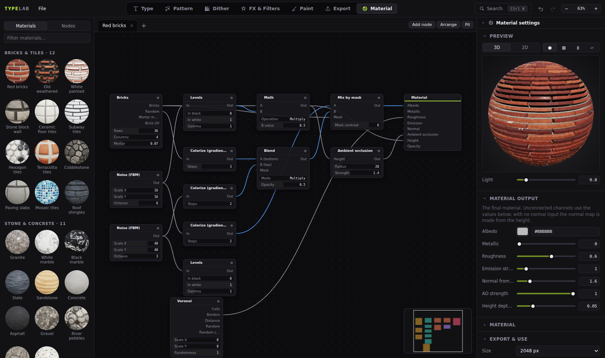

# TypeLab Material: the code

A **Material** workspace (tab 7) for TypeLab, inspired by [Material Maker](https://github.com/RodZill4/material-maker). It has a node graph, a library, 2D and 3D previews, and PBR map export.

The add-on is complete and tested. **To add it, you copy files in and add 9 lines to `app/index.html`. No existing TypeLab file needs editing.** Install steps are in [INSTALL.md](INSTALL.md).

| | |
|---|---|
| **90 starter materials** | Bricks and tiles, stone, wood, metal, fabric and leather, ground, organic, sci-fi, plastic and paper, typography. The full list is in [docs/MATERIALS.md](docs/MATERIALS.md). |
| **54 nodes** | 19 generators, 10 adjust, 4 combine, 6 filters, 4 transform, 5 height and normal, 5 TypeLab sources (Text, Layer, Document, Pattern, Image) and the Material output |
| **Previews** | 3D: sphere, rounded cube, cylinder or plane, with GGX lighting, parallax depth, emission and alpha. 2D: tiled ×1, ×2 or ×3, any single channel, or one node's output. |
| **Export** | Albedo, normal (OpenGL or DirectX), roughness, metallic, AO, height, emission, opacity and ORM-packed PNGs, plus the graph JSON, in one `.zip` at 512–4096 px |
| **Back into TypeLab** | "Add as a layer" tiles the material across the page, lit or flat. The Text, Layer, Document and Pattern nodes bring TypeLab content *into* a material. |
| **Undo, save, autosave** | Graphs live in `doc.materials`, so every edit is one history step and is saved in `.typelab` files and autosave |




## Files

```
app/css/material.css                 workspace styles (TypeLab tokens: --panel*, --line*, --acc)
app/js/material/mat-glsl.js          GLSL library: integer hashes, periodic value/Perlin/cellular noise, fbm, voronoi, SDFs
app/js/material/mat-core.js          node registry, graph model (doc.materials), GPU engine, 2D display + readback
app/js/material/mat-nodes.js         built-in GPU nodes (generators, filters, blends, height/normal, Material output)
app/js/material/mat-nodes-typelab.js Text · Layer · Document · Pattern (all 112 generators) · Image source nodes
app/js/material/mat-presets.js       the 90 starter materials, written with a small builder
app/js/material/mat-preview3d.js     3D preview (meshes, PBR shader, parallax)
app/js/material/mat-graph.js         node graph editor (DOM nodes + SVG wires, minimap, add-node search)
app/js/ui/mode-material.js           the workspace: tab, library, tabs, inspector, export, key guard, Ctrl+K
index.html.patch                     the 9 added lines (also listed in INSTALL.md)
tests/                               Playwright tests: every node, every material, a UI walk-through
docs/                                catalog + screenshots
```

## How it works

**Data.** `TL.doc.materials = [{ id, name, size, nodes: [{ id, type, x, y, p, seed, imageId?, preview? }], links: [{ from, out, to, in }] }]`
- `mat-core.js` wraps `TL.migrate`, so documents that are old, damaged or new always get a valid list. Nodes of unknown types are kept, not dropped.
- The Image node stores its picture as `imageId`. That is one of the keys TypeLab's asset regex already tracks, so images are saved and protected from garbage collection.

**Engine** (`mat-core.js`)
- It runs in its **own WebGL2 context**, so `TL.gl`'s state is never touched.
- Each node output is one fragment shader. The shader is the GLSL head, then the library, then generated input samplers `i_<k>(uv)`, then the node's code.
- Outputs render into **RGBA16F textures with REPEAT wrapping** (RGBA8 if float isn't available), so blurs, warps and normals tile seamlessly.
- Results are cached by a hash of everything upstream (params, seed, size, sources, input hashes), so a change re-runs only the nodes below it.
- Multi-pass nodes (such as blur) use `passes`.
- A GPU memory budget (384 MB) evicts outputs that haven't been used recently.
- Source nodes (text, layer, pattern, image) render on the CPU and are uploaded once. Pattern tiles from texturelib render on TypeLab's workers, and the result reaches dependent nodes when it arrives.

**Workspace** (`mode-material.js`) hooks in by **wrapping**, so no existing file is edited:
- `UI.registerMode(...)`, plus `UI.modeOrder.push('material')`, which gives it tab 7 and the number key 7.
- `UI.setMode`, `UI.refresh` and `UI.buildTopbar` are wrapped to show or hide its own view (`#matgraph` inside `#viewport`) and to set the tab tooltip.
- A **capture-phase key guard** stops graph keys from reaching `tools.js`, where `Delete` would delete the selected *layer*. Undo, redo, save, open, Ctrl+K, F1, Tab and the number keys still pass through.
- CSS hides the tool rail, the canvas and the Layers and History panels while the tab is open. An empty dock collapses to zero width.
- Settings panel (right dock): Preview (3D or 2D), the selected node's settings (via `UI.paramControl`), Material settings, and Export & use.

## Extending

```js
// a new node (GLSL; see the conventions at the top of mat-nodes.js)
TL.mat.def({ id: 'rings', name: 'Rings', cat: 'Generators', help: 'Concentric rings',
  params: [{ k: 'count', label: 'Count', min: 1, max: 32, def: 6, step: 1 }],
  outputs: [{ k: 'out', label: 'Out', type: 'gray', expr: '0.5 + 0.5*cos(length(fract(uv) - 0.5)*p_count*TAU)' }] });

// a new starter material (builder API at the top of mat-presets.js)
TL.mat.preset('Teal tiles', 'Bricks & tiles', 'Glossy teal squares', (g) => {
  const b = g.n('bricks', { rows: 8, cols: 8, offset: 0, mortar: 0.04 });
  g.out({ albedo: g.mix(g.col('#ddd'), g.col('#1f7a7a'), b.o('bricks'), 6), roughness: g.gray(0.2), height: b.o('bricks') });
});
```

## Credits

Inspired by [Material Maker](https://github.com/RodZill4/material-maker) (MIT, © 2018-present Rodolphe Suescun and contributors): the workflow, the node ideas and the UI layout. All the code here is new. None of Material Maker's GLSL was copied, so no licence notice is needed. If you later port nodes from its `.mmg` files, add its MIT notice to `THIRD_PARTY_NOTICES`.
